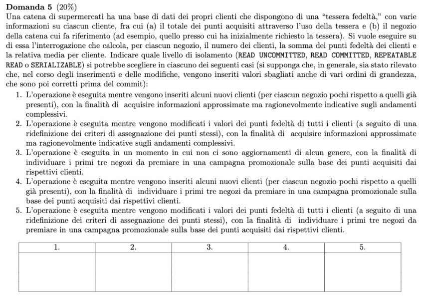

# 11 Aprile 2025

Text: Esercizio 22/09/2017 domanda 5

- `[1]`: conviene `read-committed` → in questo caso si chiede di avere informazioni approssimate MA ragionevolmente indicative, non è necessario quindi essere precisi e l’operazione viene fatta quando avvengono pochi inserimenti. Si vogliono evitare letture sporche perchè basta l’inserimento di un cliente con tanti punti per cambiare tutto. (Siccome nella traccia c’è scritto che sono inseriti pochi allora basta read-committed)
- `[2]`: conviene `repeatable-read` → (operazioni con TUTTI i clienti) non ci sono inserimenti quindi il problema del serializable non si pone, però i dati sono modificati tutti quanti
- `[3]`: conviene `read-uncommitted` → la basi di dati in questa operazione non viene “toccata”, quindi non c’è bisogno del controllo di concorrenza quindi si sceglie il livello di isolamento che permette tutto
- `[4]`: conviene `serializable` → si ha bisogno di valori precisi, ci sono inserimenti quindi deve essere per forza serializable
- `[5]`: conviene `reapeatable-read` → (operazioni con TUTTI i clienti) non ci sono inserimenti quindi il problema del serializable non si pone, però i dati sono modificati tutti quanti