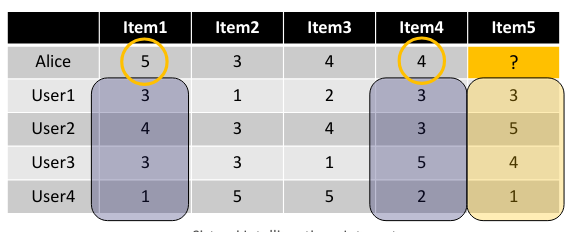

# 3 Giugno

Argomenti: Item-Based Nearest-Neighbor CF, Item-Based Preprocessing
.: Yes
Description: Collaborative Filtering

## Item-Based Nearest-Neighbor Collaborative Filtering

Negli approcci `user-based CF` rimangono alcuni problemi quando si hanno a che fare con siti di e-commerce in larga scala, nei quali occorre gestire molti utenti e item. 

Questo perchè l’analisi di potenziali neighbor rende impossibile il calcolo di predizioni in real-time, quello che si fa quindi è implementare la tecnica detta `item-based recommendation` che è più adatta per il preprocessing offline.

L’idea alla base di questo tipo di algoritmo e calcolare le predizioni usando la similarità fra item e non la similarità fra utenti, si utilizzano comunque i rating assegnati dagli utenti agli item.

Supponendo di avere questo esempio dove si vuole predirre il rating di alice per l’item 5 

Si procede in questo modo:

- si individuano tutti gli item che sono simili all’item 5, confrontando i rating vector degli altri item e poi cercando item che hanno rating simili a item 5
- si considerano i rating di alice per gli item simili per predirre il rating dell’item 5

## Cosine Similarity Measure - Basic Cosine Measure

Negli approcci di raccomandazione `item-based` la `cosine-similarity` è stabilita come metrica standard perchè consente di ottenere i risultati più accurati.

$$
sim(\overset{\to}{a},\overset{\to}{b})=\dfrac{\overset{\to}{a}\cdot \overset{\to}{b}}{|\overset{\to}{a}|*|\overset{\to}{b}|}
$$

Si possono comparare 2 documenti testuali usando questa formula se i documenti sono rappresentati come `vector-space-model`.

Se il valore si avvicina a 0 si ha `weak-similarity` mentre se si avvicina a 1 si ha `strong-similarity`. Il problema è che questa formula non tiene conto delle differenze nel comportamento di rating medio fra gli utenti

## Cosime Similarity Measure - Adjusted Cosine Measure

Il problema della `basic-cosime-measure` è risolto sottraendo la media dell’utente dai rating, i valori della nuova metrica vanno da -1 a +1 come nel `pearson-correlation-coefficient`.

$$
sim(a,b)=\dfrac{\sum_{u\in U}\left(r_{u,a}-\overline{r}_u\right)\left(r_{u,b}-\overline{r}_u\right)}{\sqrt{\sum_{u\in U}\left(r_{u,a}-\overline{r}_u\right)^2}\cdot \sqrt{\sum_{u\in U}\left(r_{u,b}-\overline{r}_u\right)^2}}
$$

Quello che si fa quindi è trasformare il database di rating originale sostituendo i valori originali di rating con le loro deviazioni dai rating medi.

## Predizioni

Una volta determinate le similarità fra gli item è possibile predire per un utente un rating per un certo item calcolando la somma pesata dei rating dell’utente per gli item che sono risultati simili all’item in questione.

$$
pred(u,p)=\dfrac{\sum_{i\in \text{ratedItems}(u)}sim(i,p)\cdot r_{u,i}}{\sum_{i\in \text{ratedItems}(a)}sim(i,p)}
$$

Formalmente si predice per l’utente $u$ un rating per l’item $p$ come mostrato nella formula.

## Preprocessing per Item-Based Filtering

Il problema principale del tradizionare `user-based CF` è che l’algoritmo non scala bene per numeri cosi grandi di utenti e item.  Dati $M$ clienti e $N$ item in catalogo, il caso peggiore prevede che tutti gli $M$ record contenenti fino a $N$ rating debbano essere valutati per individuare i peer user.

Per rendere applicaibili gli algoritmi di raccomandazione `item-based` in larga scala senza andare a diminuire l’accuratezza delle raccomandazioni è fare un `preprocessing-offline` dei dati.

L’idea è costruire a priori la `item-similarity matrix` che descrive la `pairwise-similarity` di tutti gli item in catalogo, a run time una predizione per un prodotto $p$ e un utente $u$ è fatta considerando solo gli item che sono più simili a $p$ sulla base dei rating di tutti gli altri utenti e calcolando la somma pesata dei rating di $u$ per gli item nel neighborhood

Fare preprocessing con `user-based CF` potrebbe condurre a predizioni poco accurate a causa della dinamicità della simlarità fra utenti.

Per ridurre la complessità computazionale si sfrutta soltanto una certa frazione della `rating-matrix`, facendo `supsampling` oppure utlizzare la teoria dell’informazione.