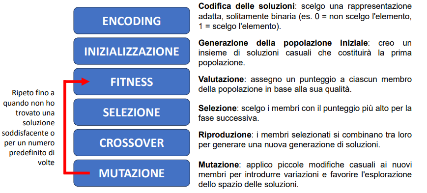

# Algoritmi Genetici

check: Yes

Gli algoritmi genetici sono ottimizzatori iterativi di tipo `stocastico`, che permettono di affrontare problemi di ottimizazione di alta complessità, tipicamente non lineare o polinomiale, utilizzando il principio di selezione del più adatto.

In questo tipo di algoritmo, un insieme di potenziali soluzioni viene fatto evolvere verso una soluzione globale ottimale eseguendo la riproduzione tra individui e mutazione del patrimonio genetico. L’ottimizzazione quindi è il risultato di un insieme di processi di selezione che nel tempo tendono a scartare configurazioni meno adatte al problema da risolvere.

Di seguito è mostrato il processo dell’algoritmo:

I criteri di arresto possono essere quando viene raggiunto il massimo numero di iterazioni prefissaato oppure l’individuo migliore continua a rimanere lo stesso (o il suo fitness non migliora) per più di $N_x$ iterazioni oppure gli individui sono tutti uguali o hanno tutti lo stesso fitness.